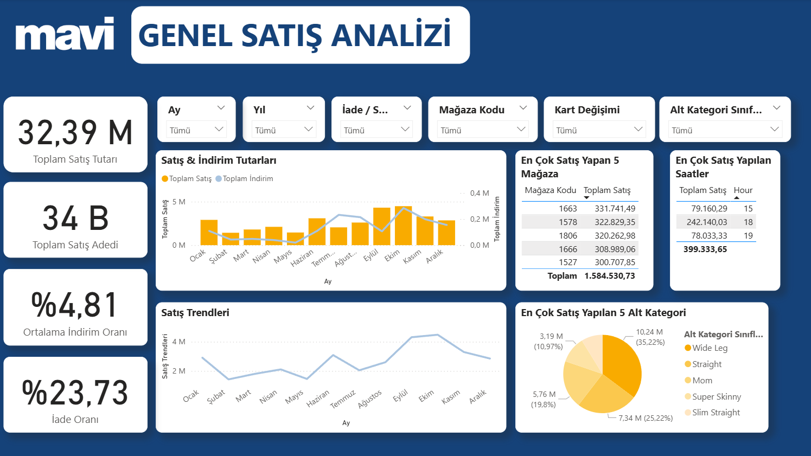
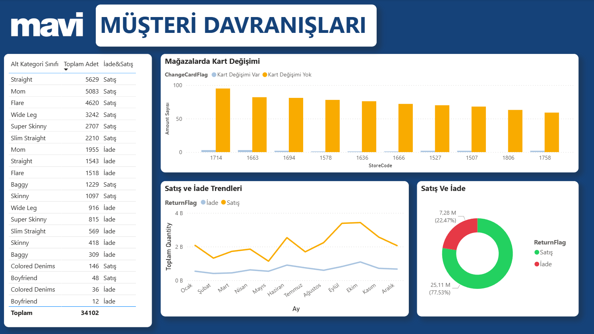

# Denim Fit Sales Analysis
Bu proje, Mavi Jeans Denim Fit Sales verilerini kullanarak satış analizleri yapmayı ve görselleştirmeyi amaçlamaktadır. Python ile Exploratory Data Analysis (EDA) çalışmaları yapılmış ve sonuçlar Power BI Dashboard üzerinde görselleştirilmiştir.

## 🚀 Proje Hakkında

Bu çalışma, müşteri alışkanlıklarını ve denim ürün satışlarını analiz ederek:

* En çok satan ürün grupları
* İndirim etkileri
* Satış trendleri (tarih bazlı)
* Müşteri davranışları
  
gibi metrikleri incelemektedir.

## Kullanılan Veriler

- Veriler, **Ludi Platformu - Mavi: NextGen Simülasyonu**’ndan alınmıştır.
- Veriler yalnızca eğitim ve analiz amaçlı kullanılmıştır.

## 🛠️ Kullanılan Teknolojiler  
       

## 📂 Veri Seti

Sales Veri Seti:
* DocID → Her işlem (satış/iade) için benzersiz bir kimlik numarası.
* StoreCode → İşlemin gerçekleştiği mağazanın kodu (mağaza bazlı analiz için kullanılabilir).
* ProductItemCode → Ürün ve varyant bazlı (renk, beden, seri gibi) ayrıntılı ürün kodu.
* ProductCode → Ürünün ana kodu (ürün grubu bazlı analiz için daha uygun).
* Date → İşlemin gerçekleştiği tarih.
* ReturnFlag → İşlemin türü (Satış mı, İade mi).
* Time → Satış/İade işleminin saati (gün içi yoğunluk analizi için kullanılabilir).
* Quantity → İşlemdeki ürün adedi.
* Amount → Satış/iade tutarı (indirim sonrası ödenen/geri ödenen tutar).
* DiscountAmount → İndirim tutarı (kampanya/indirim analizlerinde kullanılabilir).
* ChangeCardFlag → İşlem sırasında kart değişimi olup olmadığı bilgisi.

Product Veri Seti :
* ProductCode → Ürün kodu
* Class → Ürün sınıfı (örn. ticari malzeme vb.)
* MainCategory → Ana kategori (Türkçe)
* Category → Kategori (Türkçe)
* SubCategory → Alt kategori (Türkçe)
* SubCategoryClass → Alt kategori sınıfı (Türkçe)
* MainCategoryEN → Ana kategori (İngilizce)
* CategoryEN → Kategori (İngilizce)
* SubCategoryEN → Alt kategori (İngilizce)
* SubCategoryClassEN → Alt kategori sınıfı (İngilizce)

## 📈 Power BI Dashboard

Bu proje kapsamında hazırlanan Power BI Dashboard, satışları ve müşteri davranışlarını interaktif şekilde görselleştirmektedir.

Ekran görüntüsü:

